# Actividad No. 3

## Gestion de Usuarios
### Creacion de usuarios

### Asignacion de contraseñas

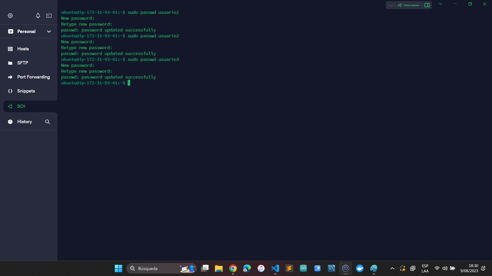

### Informacion de usuarios

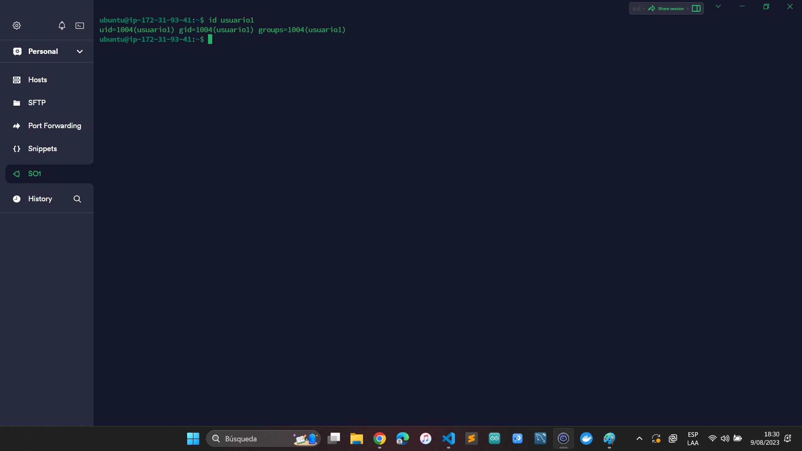

### Eliminacion de usuarios

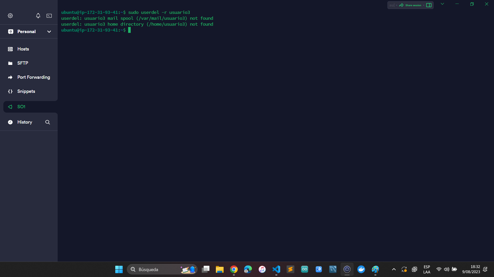

## Gestion de Grupos
### Creacion de grupos

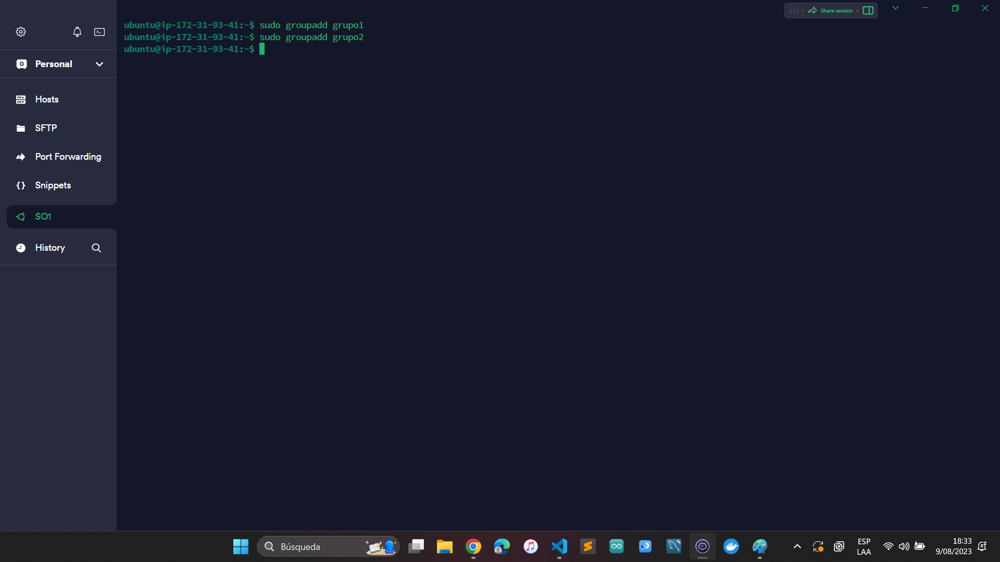

### Agregar usuarios a grupos

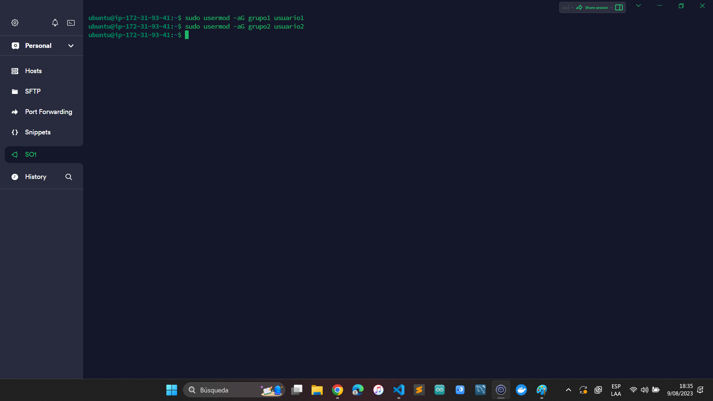

### Verificar membresía

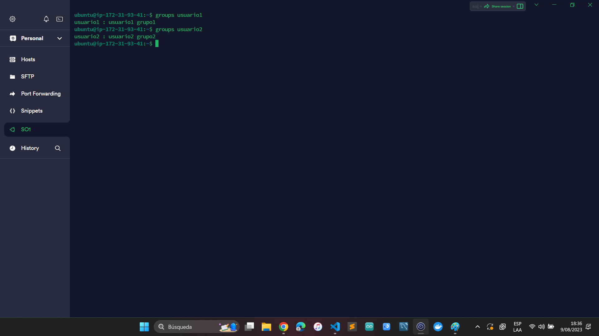

### Eliminacion de grupo

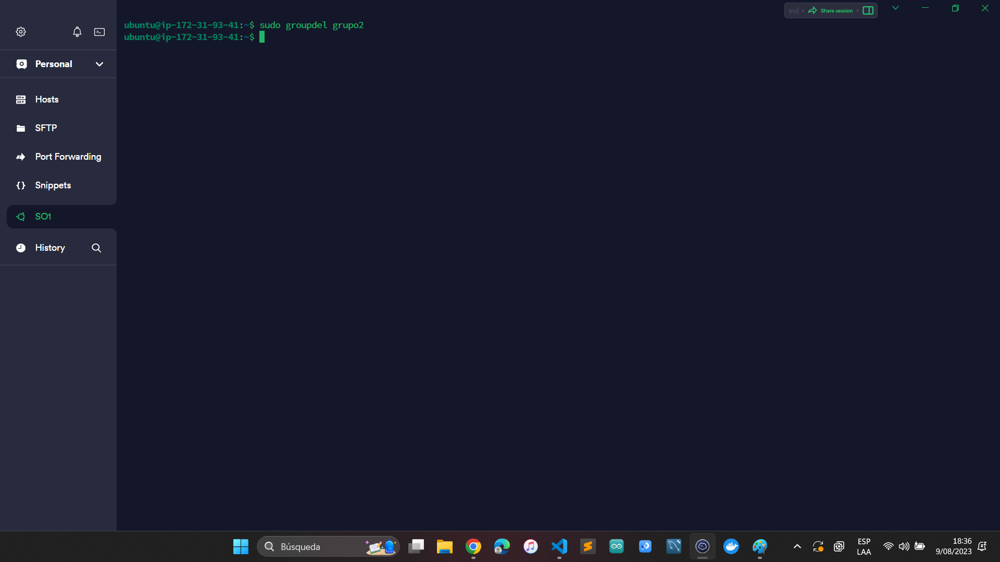

## Gestion de Permisos
### Creación de archivos y directorios

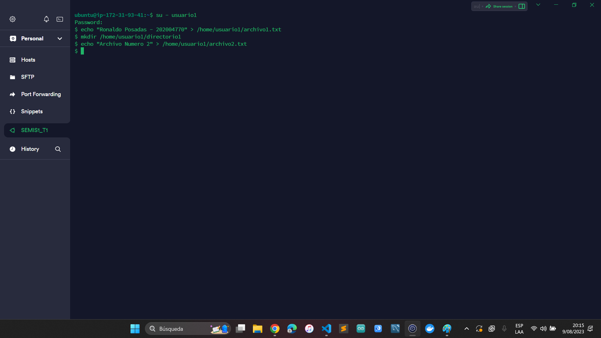

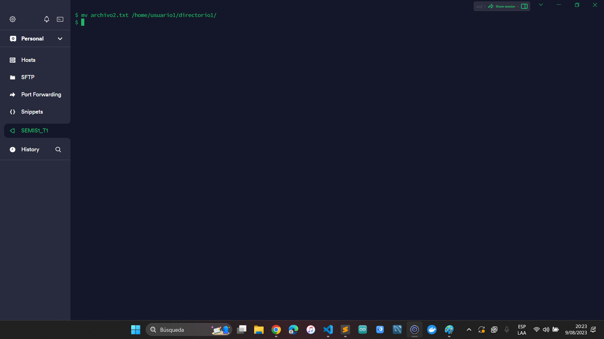

### Verificar permisos

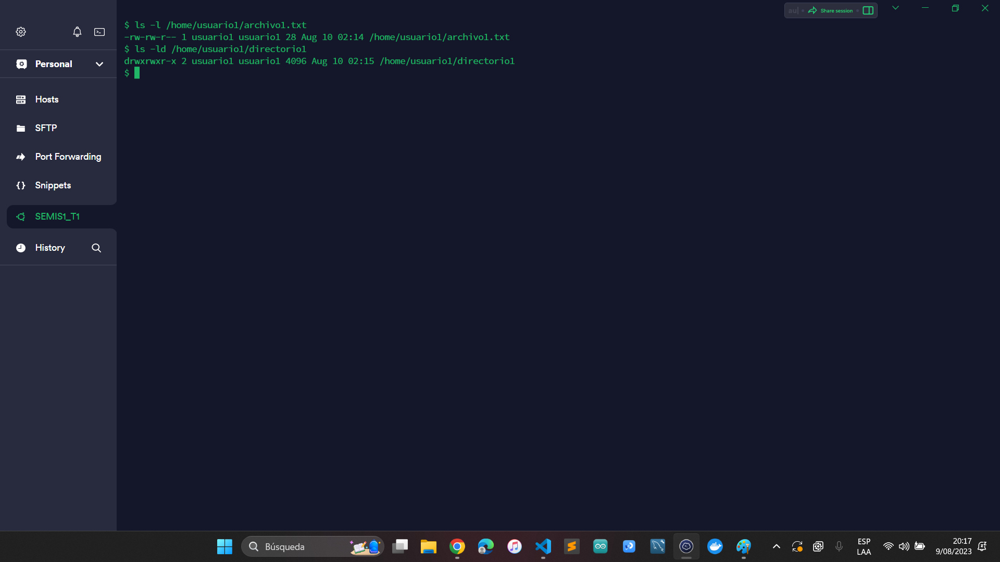

### Modificar permisos usando `chmod` con modo numérico

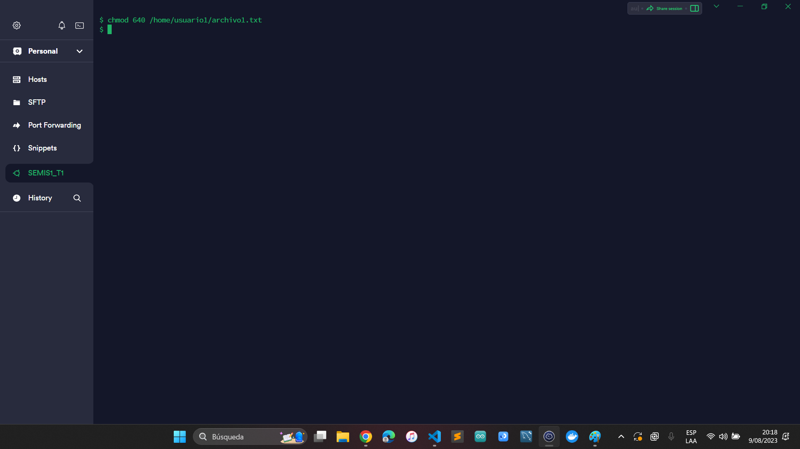

### Modificar permisos usando `chmod` con modo simbólico

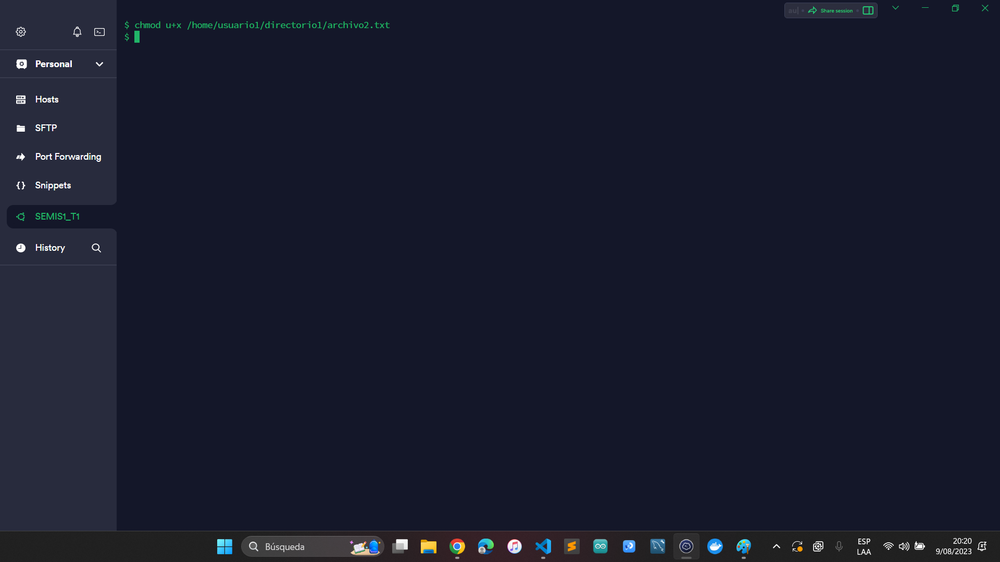

### Cambiar el grupo propietario

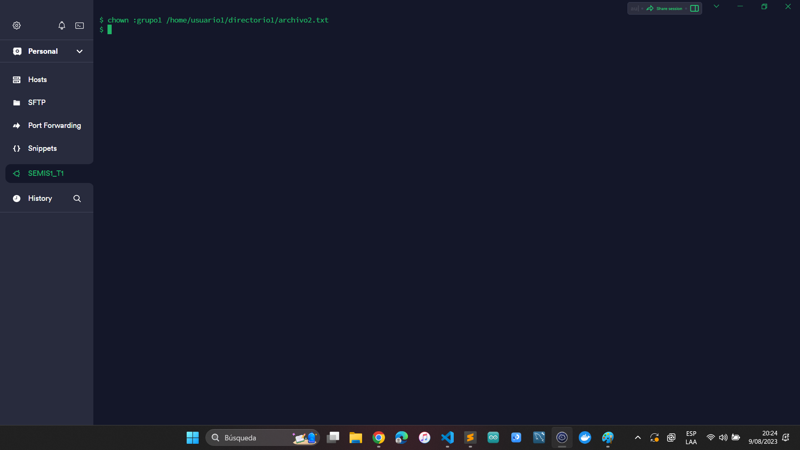

### Configurar permisos de directorio

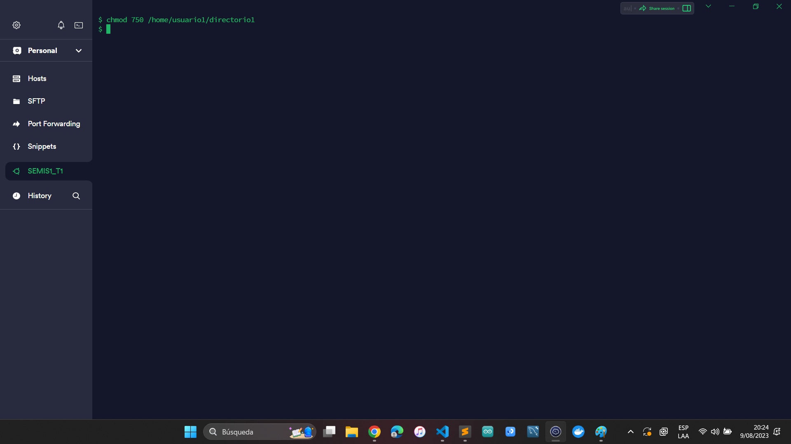

### Comprobación de acceso

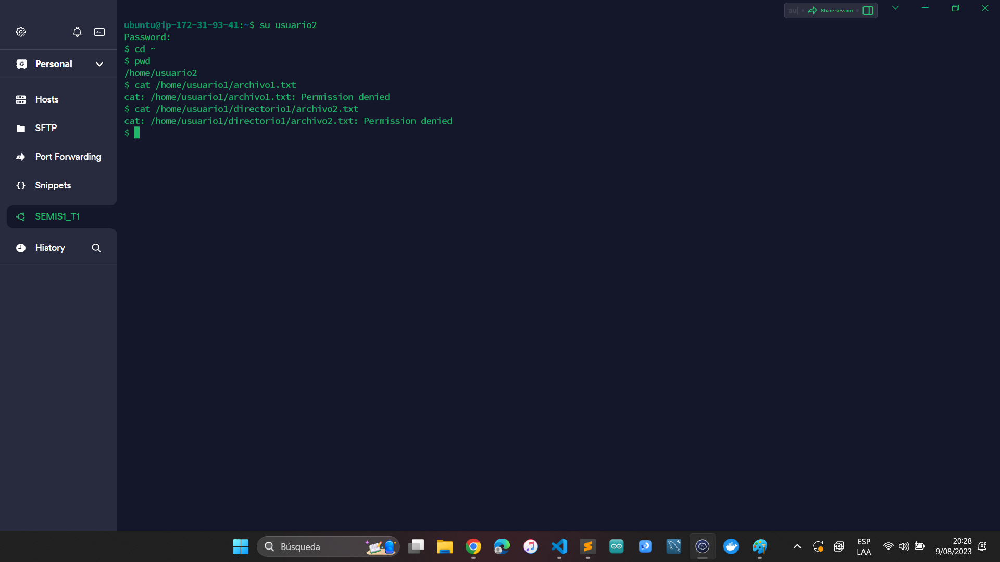

### Verificación final

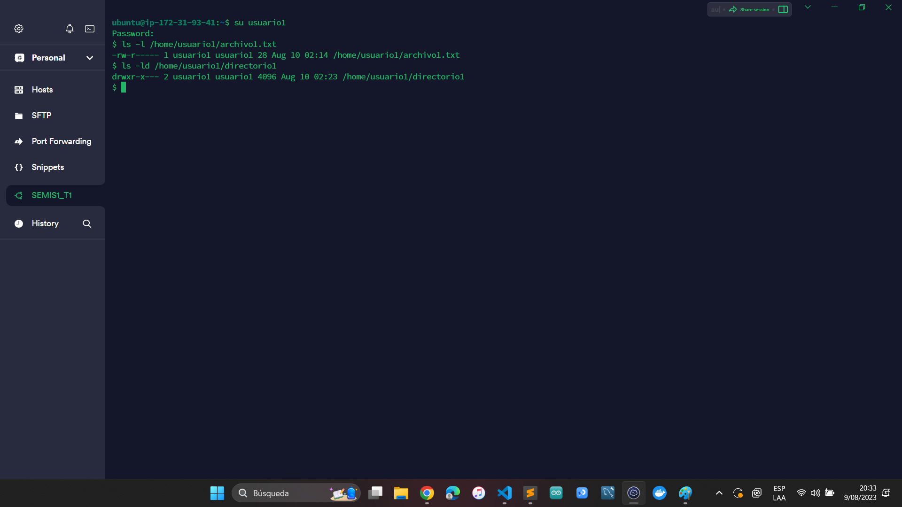

